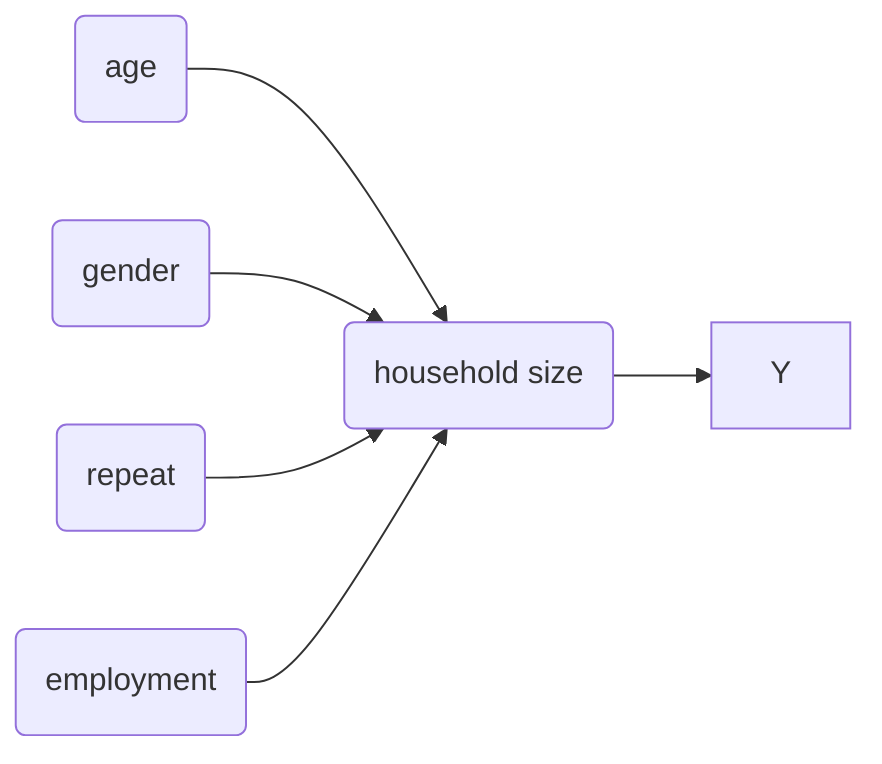
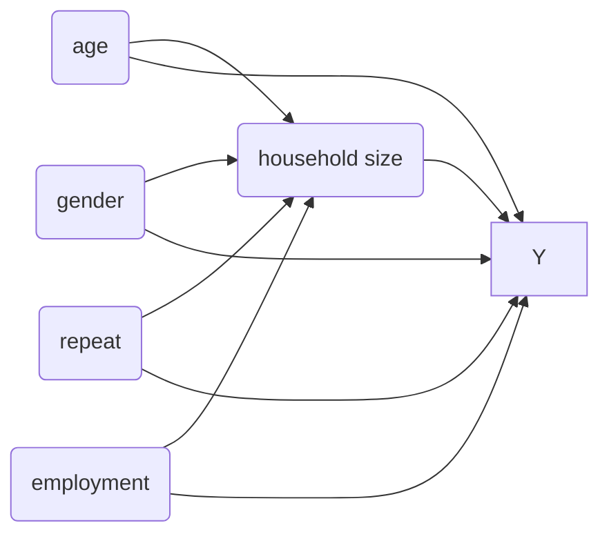
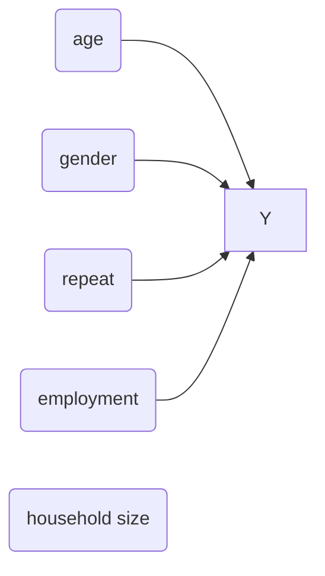

### Household contacts

```mermaid
flowchart LR

Y
x1(age)
x2(gender)
x3(repeat)
x4(employment)
x5(household size)

x5 --> Y
x1 --> x5
x2 --> x5
x3 --> x5
x4 --> x5
```

### Non-household contacts

```mermaid
flowchart LR

Y
x1(age)
x2(gender)
x3(repeat)
x4(employment)
x5(household size)

x5 --> Y
x1 --> x5
x2 --> x5
x3 --> x5
x4 --> x5

x1 --> Y
x2 --> Y
x3 --> Y
x4 --> Y
```

### Group contacts

```mermaid
flowchart LR

Y
x1(age)
x2(gender)
x3(repeat)
x4(employment)
x5(household size)

x1 --> Y
x2 --> Y
x3 --> Y
x4 --> Y
```