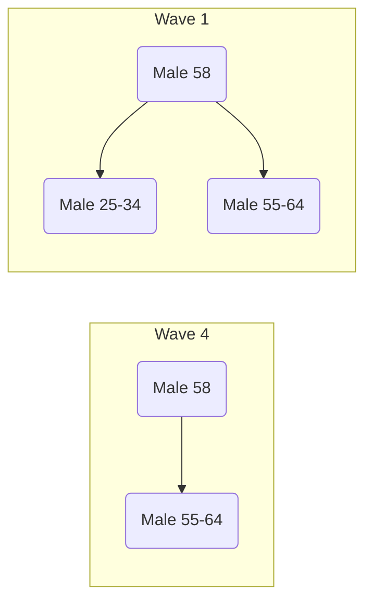
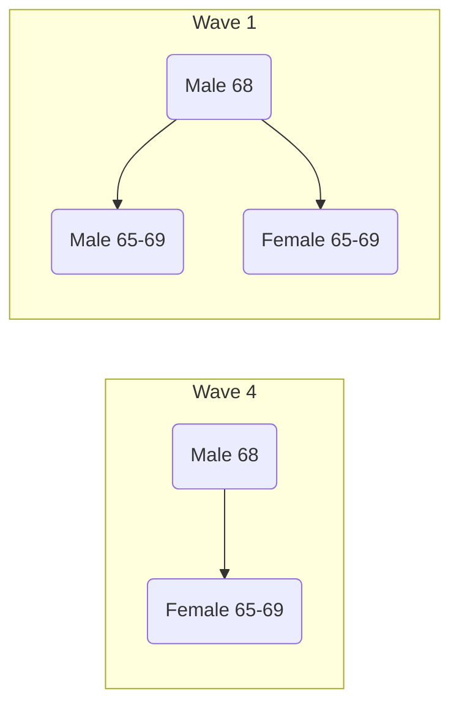
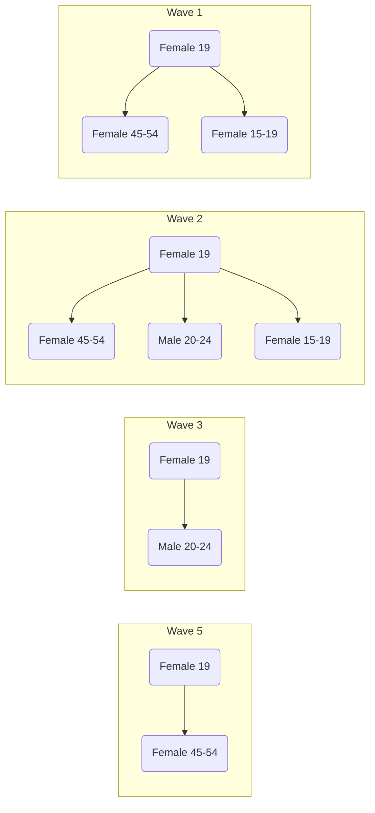

# Household Stories

- Participant is a 58 year old male, employed full-time
- In wave 1, he reported that his household comprised of two other men, one between 25-34 and another between 55-64, both of whom were employed full-time.
- In wave 4, the participant no longer reported that the younger man was part of the household.

- Participant is a 68 year old retired male
- In wave 1 he reported a household size of 3, comprised of two other retired people of the same age group. One of whom was male and the other female.
- In wave 4, the participant no longer reported that the male was part of the household.

new_id: **96ff4044**

- Participant is a 19 year old women.
- In the first wave she reported that her household size was 3, comprised of another women of the same age range and a women of age 45-54
- In the second wave a male of age 20-24 became part of the household
- In the third wave only the male was reported to be part of the household
- In the fifth wave only the women age 45-54 was reported to be part of the household

new_id: ****